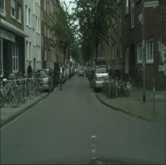
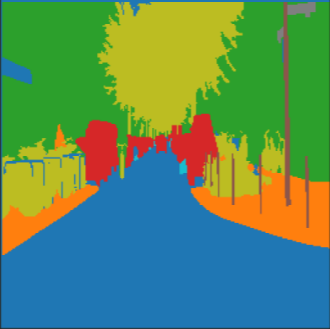
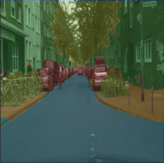

# Keras implementation of DeepLabV3+ with MobileNetV2 backbone

| IMAGE | TRUE_MASK | PRED MASK   mIoU: .56 | IMG + PRED MASK |
| :---: | :-------: | :-------: | :--------: |
|  |  |  |  |

Epoch 59: val_loss improved from 0.09584 to 0.09553, saving model to model-saved/dice_city_spacity_6.hdf5  
1488/1488 [==============================] - 858s 576ms/step  
loss: 0.0857 - dice_accuracy_ignoring_last_label: 0.9191 - sparse_accuracy_ignoring_last_label: 0.8967  
val_loss: 0.0955 - val_dice_accuracy_ignoring_last_label: 0.9093 - val_sparse_accuracy_ignoring_last_label: 0.8841

I'm still running, on my cpu, really slow...

1. **Rethinking Atrous Convolution for Semantic Image Segmentation**  
    Liang-Chieh Chen, George Papandreou, Florian Schroff, Hartwig Adam.  
    [[link]](http://arxiv.org/abs/1706.05587). arXiv: 1706.05587, 2017.

2. **DeepLabv3+: Encoder-Decoder with Atrous Separable Convolution for Semantic Image Segmentation**  
    Liang-Chieh Chen, Yukun Zhu, George Papandreou, Florian Schroff, Hartwig Adam.  
    [[link]](https://arxiv.org/abs/1802.02611). In ECCV, 2018.

3. **MobileNetV2: Inverted Residuals and Linear Bottlenecks**  
    Mark Sandler, Andrew Howard, Menglong Zhu, Andrey Zhmoginov, Liang-Chieh Chen  
    [[link]](https://arxiv.org/abs/1801.04381). In CVPR, 2018.

4. **The Cityscapes Dataset for Semantic Urban Scene Understanding**  
    Cordts, Marius, Mohamed Omran, Sebastian Ramos, Timo Rehfeld, Markus Enzweiler, Rodrigo Benenson, Uwe Franke, Stefan Roth, Bernt Schiele.   
    [[link]](https://www.cityscapes-dataset.com/). In CVPR, 2016.
