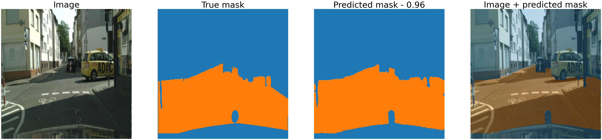
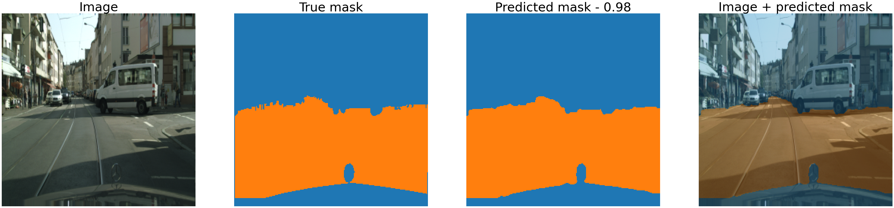
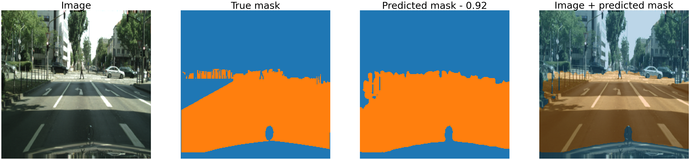
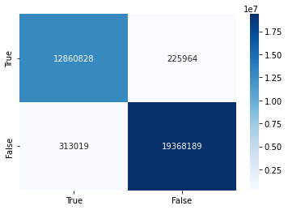

# Keras implementation of DeepLabV3+ with MobileNetV2 backbone for IFB undegraduate thesis  
## Low budget Wheelchair and Image Segmentation to decrease danger  
## Normal Wheelchair + 2x DC Motor to electric Wheelchair  
## Raspberry Pi + Camera + tflite

## DataSet: CityScapes  
*Cityscapes dataset gtFine + (gtFine + fog), (gtfine + rain)*

*This model takes different MobileNetV2 layers, for better performance on a Raspberry Pi*  
*With an image of size (256, 256) we have*  
*MbV2 output = block_12_project_BN (None, 16, 16, 96)*  
*MbV2 features = block_2_project_BN (None, 64, 64, 24)*  
*and a output stride of 4*

*Total params: 825,954*  
*Trainable params: 807,682*  
*Non-trainable params: 18,272*

## mIOU and plots  
*Mean of all validation images mIOU = .97*

1. **Rethinking Atrous Convolution for Semantic Image Segmentation**  
    Liang-Chieh Chen, George Papandreou, Florian Schroff, Hartwig Adam.  
    [[link]](http://arxiv.org/abs/1706.05587). arXiv: 1706.05587, 2017.

2. **DeepLabv3+: Encoder-Decoder with Atrous Separable Convolution for Semantic Image Segmentation**  
    Liang-Chieh Chen, Yukun Zhu, George Papandreou, Florian Schroff, Hartwig Adam.  
    [[link]](https://arxiv.org/abs/1802.02611). In ECCV, 2018.

3. **MobileNetV2: Inverted Residuals and Linear Bottlenecks**  
    Mark Sandler, Andrew Howard, Menglong Zhu, Andrey Zhmoginov, Liang-Chieh Chen  
    [[link]](https://arxiv.org/abs/1801.04381). In CVPR, 2018.

4. **The Cityscapes Dataset for Semantic Urban Scene Understanding**  
    Cordts, Marius, Mohamed Omran, Sebastian Ramos, Timo Rehfeld, Markus Enzweiler, Rodrigo Benenson, Uwe Franke, Stefan Roth, Bernt Schiele.   
    [[link]](https://www.cityscapes-dataset.com/). In CVPR, 2016.

Python 3.7  
GPU=RTX 3080  
tensorflow==2.7.3